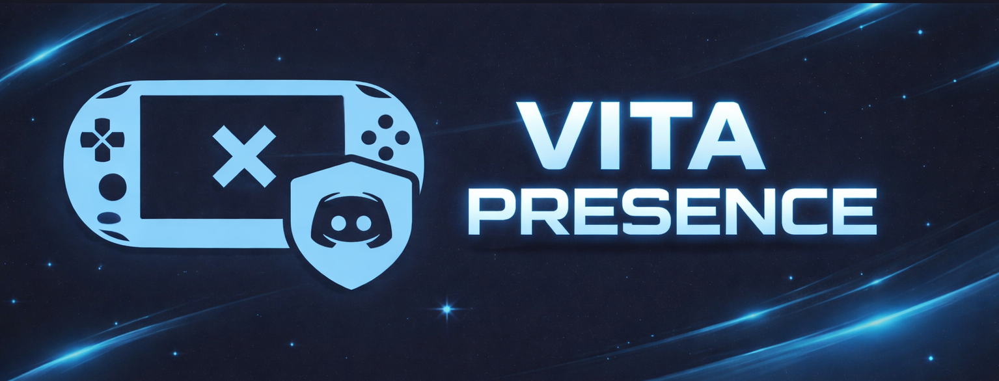

<div align="center">

<!-- BANNER: coloque sua imagem aqui -->



# VitaPresence

**🇧🇷 [Português](#português) · 🇺🇸 [English](#english)**

[](https://github.com/seu-usuario/vitapresence/releases)
[](https://github.com/seu-usuario/vitapresence/actions)
[](LICENSE)
[](https://github.com/seu-usuario/vitapresence/releases)

</div>

---

# Português

Mostre seu jogo do **PS Vita** como **Discord Rich Presence** — app desktop leve (~10MB) para Linux, Windows e macOS, construído com Tauri 2 + Rust + React.

## Como funciona

```
PS Vita                      PC (VitaPresence)             Discord
┌────────────┐  TCP/51966   ┌─────────────────┐   IPC    ┌─────────┐
│ .skprx     │ ────────────▶│  Tauri (Rust)   │ ────────▶│ Discord │
│ (kernel)   │  146 bytes   │  + React UI     │          │ desktop │
└────────────┘              └─────────────────┘          └─────────┘
```

O plugin kernel no PS Vita abre um servidor TCP na porta **51966 (0xCAFE)**. A cada conexão, envia um packet com o título e Title ID do jogo atual. O VitaPresence lê esse packet e atualiza seu status no Discord via IPC local.

## Funcionalidades

- 🎮 Jogos nativos PS Vita
- 📀 PSP via Adrenaline (lê o jogo diretamente da memória)
- 🕹️ Emuladores nativos (mGBA, Snes9x, RetroArch, DeSmuME...)
- 🖼️ Capas automáticas por Title ID (PSMT-Covers, NutDB, xlenore)
- 🎨 Capas em alta qualidade via IGDB (gratuito, opcional)
- 🖼️ Ícone customizado com URL própria
- ⏱️ Timer de sessão no Discord
- 🌍 Interface em Português e Inglês
- 🔔 System tray — roda em background
- 🔒 **100% local — nenhum dado enviado para servidores externos**

## Privacidade

**Todos os dados ficam no seu computador.**

- Configuração salva em `~/.config/vitapresence/config.json` (Linux/Mac) ou `%APPDATA%\vitapresence\` (Windows)
- Nenhuma telemetria, nenhum servidor relay, nenhum cadastro
- Comunicação de rede apenas:
  - TCP local → PS Vita (mesma rede)
  - IPC local → Discord (socket unix no mesmo PC)
  - HTTPS → IGDB / GitHub (só para buscar capas, se configurado)

## Download

Baixe o instalador em [Releases](https://github.com/seu-usuario/vitapresence/releases):

| Plataforma             | Arquivo                        |
| ---------------------- | ------------------------------ |
| 🐧 Linux AppImage      | `VitaPresence_*.AppImage`      |
| 🐧 Linux RPM (Fedora)  | `VitaPresence_*.rpm`           |
| 🐧 Linux DEB (Ubuntu)  | `VitaPresence_*.deb`           |
| 🪟 Windows             | `VitaPresence_*_x64-setup.exe` |
| 🍎 macOS Apple Silicon | `VitaPresence_*_aarch64.dmg`   |
| 🍎 macOS Intel         | `VitaPresence_*_x64.dmg`       |

## Configuração

### 1. Plugin no PS Vita

1. Baixe `VitaPresence.skprx` em [Electry/VitaPresence/releases](https://github.com/Electry/VitaPresence/releases)
2. Copie para `ux0:tai/` no seu Vita
3. Adicione em `ux0:tai/config.txt` na seção `*KERNEL`:
   ```
   *KERNEL
   ux0:tai/VitaPresence.skprx
   ```
4. Reinicie o Vita

### 2. Discord Client ID

1. Acesse [discord.com/developers/applications](https://discord.com/developers/applications)
2. **New Application** → dê qualquer nome (ex: `PS Vita`)
3. Copie o **Application ID** — esse é o Client ID

### 3. No app

1. Abra o VitaPresence
2. Preencha o **IP do Vita** (ex: `192.168.1.42`) ou MAC address
3. Preencha o **Discord Client ID**
4. Clique em **Salvar** → **Conectar**
5. O status do Discord será atualizado automaticamente

## Capas de jogos

### GitHub (automático, sem configuração)

Capas buscadas por Title ID:

- [SvenGDK/PSMT-Covers](https://github.com/SvenGDK/PSMT-Covers) — PS Vita e PSP
- [nicoboss/NutDB](https://github.com/nicoboss/NutDB) — ícones PS Vita
- [xlenore/psp-covers](https://github.com/xlenore/psp-covers) — PSP
- [xlenore/psx-covers](https://github.com/xlenore/psx-covers) — PS1

### IGDB (alta qualidade, opcional)

1. Acesse [dev.twitch.tv/console/apps/create](https://dev.twitch.tv/console/apps/create)
2. Crie um app → copie **Client ID** e gere **Client Secret**
3. Cole nos campos **Capa de Jogos** no VitaPresence
4. O token é renovado automaticamente

### Ícone customizado

Defina uma URL pública de imagem — tem prioridade sobre IGDB e GitHub. Útil para logo do PS Vita ou arte personalizada.

## Compilar do código-fonte

### Dependências do sistema

```bash
# Fedora
sudo dnf install webkit2gtk4.1-devel gtk3-devel libappindicator-gtk3-devel \
  librsvg2-devel openssl-devel curl wget file libatomic

# Ubuntu/Debian
sudo apt install libwebkit2gtk-4.1-dev libgtk-3-dev libayatana-appindicator3-dev \
  librsvg2-dev build-essential

# Arch/Manjaro
sudo pacman -S webkit2gtk-4.1 gtk3 libayatana-appindicator librsvg base-devel
```

### Rust

```bash
curl --proto '=https' --tlsv1.2 -sSf https://sh.rustup.rs | sh
source ~/.cargo/env
```

### Build

```bash
git clone https://github.com/seu-usuario/vitapresence
cd vitapresence
npm install && npm run setup
npm run build
# executável: src-tauri/target/release/vitapresence
# instaladores: src-tauri/target/release/bundle/
```

### Dev com hot reload

```bash
npm run dev
```

## Release automatizada (CI/CD)

Para publicar uma nova versão com binários para todas as plataformas:

```bash
git tag v1.0.0
git push origin v1.0.0
```

O GitHub Actions compila automaticamente para Linux, Windows e macOS.

## Créditos e inspirações

Este projeto é um port multiplataforma do **VitaPresence original** e não existiria sem:

| Projeto                                                                                           | Contribuição                                                                                                                                                                                                                                    |
| ------------------------------------------------------------------------------------------------- | ----------------------------------------------------------------------------------------------------------------------------------------------------------------------------------------------------------------------------------------------- |
| [**Electry/VitaPresence**](https://github.com/Electry/VitaPresence)                               | Criador do VitaPresence original (C#/.NET para Windows) e do plugin `.skprx` para PS Vita. O protocolo TCP, o formato do packet `vitapresence_data_t`, o suporte ao Adrenaline e a detecção de emuladores foram todos baseados no seu trabalho. |
| [**TheMightyV/vita-presence-the-server**](https://github.com/TheMightyV/vita-presence-the-server) | Reimplementação cross-platform em C++ do app desktop do VitaPresence, com suporte a thumbnails por Title ID.                                                                                                                                    |
| [**SvenGDK/PSMT-Covers**](https://github.com/SvenGDK/PSMT-Covers)                                 | Repositório de capas PS Vita e PSP.                                                                                                                                                                                                             |
| [**nicoboss/NutDB**](https://github.com/nicoboss/NutDB)                                           | Banco de ícones de títulos PS Vita.                                                                                                                                                                                                             |
| [**xlenore**](https://github.com/xlenore)                                                         | Repositórios de capas PSP e PS1.                                                                                                                                                                                                                |
| [**IGDB**](https://www.igdb.com/)                                                                 | API de metadados de jogos via Twitch.                                                                                                                                                                                                           |

---

# English

Show your **PS Vita** game as **Discord Rich Presence** — a lightweight (~10MB) desktop app for Linux, Windows and macOS, built with Tauri 2 + Rust + React.

## How it works

```
PS Vita                      PC (VitaPresence)             Discord
┌────────────┐  TCP/51966   ┌─────────────────┐   IPC    ┌─────────┐
│ .skprx     │ ────────────▶│  Tauri (Rust)   │ ────────▶│ Discord │
│ (kernel)   │  146 bytes   │  + React UI     │          │ desktop │
└────────────┘              └─────────────────┘          └─────────┘
```

The kernel plugin on your PS Vita opens a TCP server on port **51966 (0xCAFE)**. On each connection, it sends a 146-byte packet with the current game's title and Title ID. VitaPresence reads that packet and updates your Discord status via local IPC.

## Features

- 🎮 Native PS Vita games
- 📀 PSP via Adrenaline (reads the game directly from memory)
- 🕹️ Native emulators (mGBA, Snes9x, RetroArch, DeSmuME...)
- 🖼️ Automatic covers by Title ID (PSMT-Covers, NutDB, xlenore)
- 🎨 High quality covers via IGDB (free, optional)
- 🖼️ Custom icon with your own URL
- ⏱️ Session timer on Discord
- 🌍 Portuguese and English UI
- 🔔 System tray — runs in background
- 🔒 **100% local — no data sent to external servers**

## Privacy

**All data stays on your computer.**

- Config saved at `~/.config/vitapresence/config.json` (Linux/Mac) or `%APPDATA%\vitapresence\` (Windows)
- No telemetry, no relay servers, no sign-up required
- Network communication only:
  - TCP local → PS Vita (same network)
  - IPC local → Discord (unix socket on the same PC)
  - HTTPS → IGDB / GitHub (only to fetch covers, if configured)

## Download

Download the installer from [Releases](https://github.com/seu-usuario/vitapresence/releases):

| Platform               | File                           |
| ---------------------- | ------------------------------ |
| 🐧 Linux AppImage      | `VitaPresence_*.AppImage`      |
| 🐧 Linux RPM (Fedora)  | `VitaPresence_*.rpm`           |
| 🐧 Linux DEB (Ubuntu)  | `VitaPresence_*.deb`           |
| 🪟 Windows             | `VitaPresence_*_x64-setup.exe` |
| 🍎 macOS Apple Silicon | `VitaPresence_*_aarch64.dmg`   |
| 🍎 macOS Intel         | `VitaPresence_*_x64.dmg`       |

## Setup

### 1. Plugin on PS Vita

1. Download `VitaPresence.skprx` from [Electry/VitaPresence/releases](https://github.com/Electry/VitaPresence/releases)
2. Copy it to `ux0:tai/` on your Vita
3. Add to `ux0:tai/config.txt` under the `*KERNEL` section:
   ```
   *KERNEL
   ux0:tai/VitaPresence.skprx
   ```
4. Reboot your Vita

### 2. Discord Client ID

1. Go to [discord.com/developers/applications](https://discord.com/developers/applications)
2. **New Application** → any name (e.g. `PS Vita`)
3. Copy the **Application ID** — that's your Client ID

### 3. In the app

1. Open VitaPresence
2. Fill in the **Vita IP** (e.g. `192.168.1.42`) or MAC address
3. Fill in the **Discord Client ID**
4. Click **Save** → **Connect**
5. Your Discord status will update automatically

## Game covers

### GitHub (automatic, no setup needed)

Covers fetched by Title ID:

- [SvenGDK/PSMT-Covers](https://github.com/SvenGDK/PSMT-Covers) — PS Vita and PSP
- [nicoboss/NutDB](https://github.com/nicoboss/NutDB) — PS Vita icons
- [xlenore/psp-covers](https://github.com/xlenore/psp-covers) — PSP
- [xlenore/psx-covers](https://github.com/xlenore/psx-covers) — PS1

### IGDB (high quality, optional)

1. Go to [dev.twitch.tv/console/apps/create](https://dev.twitch.tv/console/apps/create)
2. Create an app → copy **Client ID** and generate **Client Secret**
3. Paste in the **Game Covers** section in VitaPresence
4. Token renews automatically

### Custom icon

Set a public image URL — takes priority over IGDB and GitHub.

## Build from source

### System dependencies

```bash
# Fedora
sudo dnf install webkit2gtk4.1-devel gtk3-devel libappindicator-gtk3-devel \
  librsvg2-devel openssl-devel curl wget file libatomic

# Ubuntu/Debian
sudo apt install libwebkit2gtk-4.1-dev libgtk-3-dev libayatana-appindicator3-dev \
  librsvg2-dev build-essential

# Arch/Manjaro
sudo pacman -S webkit2gtk-4.1 gtk3 libayatana-appindicator librsvg base-devel
```

### Rust

```bash
curl --proto '=https' --tlsv1.2 -sSf https://sh.rustup.rs | sh
source ~/.cargo/env
```

### Build

```bash
git clone https://github.com/seu-usuario/vitapresence
cd vitapresence
npm install && npm run setup
npm run build
# binary: src-tauri/target/release/vitapresence
# installers: src-tauri/target/release/bundle/
```

### Dev with hot reload

```bash
npm run dev
```

## Automated releases (CI/CD)

To publish a new release with binaries for all platforms:

```bash
git tag v1.0.0
git push origin v1.0.0
```

GitHub Actions automatically builds for Linux, Windows and macOS.

## Credits and inspirations

This project is a cross-platform port of the original **VitaPresence** and would not exist without:

| Project                                                                                           | Contribution                                                                                                                                                                                                            |
| ------------------------------------------------------------------------------------------------- | ----------------------------------------------------------------------------------------------------------------------------------------------------------------------------------------------------------------------- |
| [**Electry/VitaPresence**](https://github.com/Electry/VitaPresence)                               | Creator of the original VitaPresence (C#/.NET for Windows) and the `.skprx` kernel plugin. The TCP protocol, `vitapresence_data_t` packet format, Adrenaline support and emulator detection were all based on his work. |
| [**TheMightyV/vita-presence-the-server**](https://github.com/TheMightyV/vita-presence-the-server) | Cross-platform C++ reimplementation of the VitaPresence desktop app, with per-game thumbnail support.                                                                                                                   |
| [**SvenGDK/PSMT-Covers**](https://github.com/SvenGDK/PSMT-Covers)                                 | PS Vita and PSP cover art repository.                                                                                                                                                                                   |
| [**nicoboss/NutDB**](https://github.com/nicoboss/NutDB)                                           | PS Vita title icon database.                                                                                                                                                                                            |
| [**xlenore**](https://github.com/xlenore)                                                         | PSP and PS1 cover art repositories.                                                                                                                                                                                     |
| [**IGDB**](https://www.igdb.com/)                                                                 | Game metadata API via Twitch.                                                                                                                                                                                           |

---

## License / Licença

GPL-3.0 — same as the original VitaPresence project.

<div align="center"><sub>Made with ❤️ for the PS Vita community · Feito com ❤️ para a comunidade PS Vita</sub></div>
